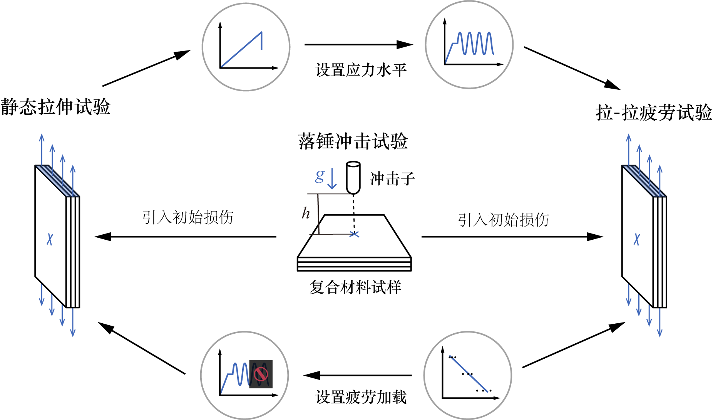

复合材料的疲劳力学试验涉及多个步骤和理论原理解释材料在反复加载或持续载荷下的性能变化。

### 1. **试验目的**
- 测定玻纤复合材料板在单轴应力下，其疲劳寿命（即在循环加载过程中能够承受的最大循环次数）或其破坏时的应力水平。
- 为确定材料的S-N曲线（即将应力与对数循环次数对应起来的曲线），从而评估其疲劳性能。

---

### 2. **试验步骤**
1. **试验准备**：
   - 准备多批试样，确保材料一致性。
   - 检查试样表面是否有裂纹、气孔或其他缺陷，避免影响试验结果。

2. **加载设备**：
   - 使用单轴压力或拉伸测试机，控制载荷峰值（如50%、75%或100%的材料强度）和载荷频率（常见于5Hz到10Hz）。
   - 确保试验环境稳定，避免温度或湿度过大对结果造成偏差。

3. **施加应力**：
   - 缓慢加载至目标应力值。
   - 在循环加载过程中，记录每次达到最大应力的循环次数（即N）。

4. **破坏观察**：
   - 当试样发生断裂或明显损坏时，记录此时的最大应力和对应的循环次数。

5. **数据记录**：
   - 记录每个试样的应力水平、循环次数以及破坏情况。
   - 对多批次试样进行统计分析。

---

### 3. **测试设备与环境**
- **测试设备**：单轴力学测试机（如压力或拉伸测试机）、加载控制系统、循环计数器等。
- **环境因素**：确保试验室的温度、湿度和空气污染条件符合标准，避免对材料性能产生影响。

---

### 4. **结果分析**
通过统计试样数据，可以绘制玻纤复合材料板的S-N曲线，并评估其疲劳性能。例如：
- 在某一应力水平下，其循环承载能力是多少。
- 材料在达到某一循环次数时会破坏吗？

---

### 5. **意义与应用**
- **材料性能评估**：通过S-N曲线了解玻纤复合材料板的疲劳寿命，判断其适用性。
- **设计优化**：结合S-N曲线设计轻量化结构或高应力场景下的零件。
